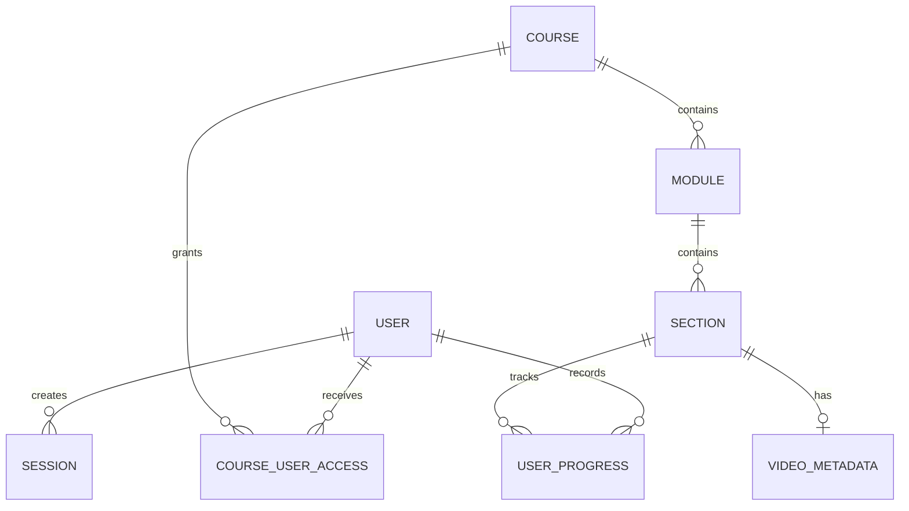
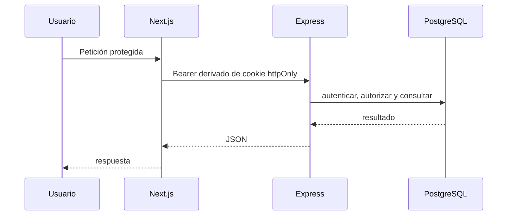

# Sistema actual

_Estado observado en el árbol de trabajo, 31 de agosto de 2026. Describe la implementación actual, no la arquitectura objetivo._

`video-repo` es un monorepo npm para educación de baile. Gestiona cursos, módulos, secciones, metadatos de vídeo y progreso.

## Componentes

```mermaid
flowchart LR
  B[Browser] --> N[Frontend: Next.js 15\nApp Router]
  N --> X[Auth handlers y\n/api/proxy/[...path]]
  X --> E[Backend: Express 5]
  E --> M[Middleware\nauth + policies + Zod]
  M --> C[Controllers]
  C --> S[Models / services]
  S --> P[Prisma]
  P --> D[(PostgreSQL)]
  E --> V[Vídeos locales]
```

- `frontend/`: Next.js 15, React 19, TypeScript y Tailwind. La navegación primaria es `/courses`; `/library` es legado/compatibilidad.
- `backend/`: API REST Express con capas ruta → middleware → controller → modelo/servicio → Prisma.
- `backend/prisma/schema.prisma`: esquema PostgreSQL.
- Existe Dockerfile del backend. Aún no hay `docker-compose.yml` ni contenedor del frontend.

## Modelo y acceso



La jerarquía canónica es `Course → Module → Section → VideoMetadata`. Los roles globales son `ADMIN`, `INSTRUCTOR` y `STUDENT`; por curso se asignan `READ`, `WRITE` y `MAINTAIN`. Currículo y progreso usan borrado lógico; `CourseUserAccess` no.

## Seguridad y flujo HTTP

El backend acepta cookie o Bearer. El flujo web previsto conserva `video_repo_token` como cookie `httpOnly`; el proxy de Next la convierte en Bearer para Express, sin exponerla al JavaScript del navegador.



Las rutas y contratos operativos están en [docs/api.md](../../docs/api.md).

## Deuda y objetivo inmediato

- No es una arquitectura hexagonal ni DDD formal: es una arquitectura en capas. La evolución debe ser incremental, empezando por acceso y progreso.
- El seed actual hace `upsert` de usuarios y accesos, pero crea cursos en cada ejecución: no es idempotente.
- La CI usa `prisma db push`; no cumple la política objetivo de migraciones versionadas.
- Estado objetivo de arranque: esperar PostgreSQL, comprobar/aplicar migraciones pendientes y ejecutar un seed idempotente sólo cuando la base esté vacía. Esto **no está implementado aún**.
- La colección Postman versionada vive en `docs/postman/` y debe evolucionar junto a cada cambio de API.

`docs/superpowers/` conserva diseños y planes históricos; no es contrato vigente.
