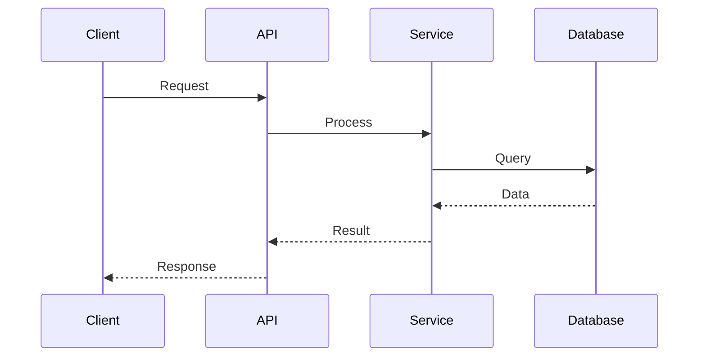

# Data Flow

## Overview
[High-level data flow description]

## Key Flows

### Flow 1: [Name]

**Components**: [List components involved]
**Data Transformations**: [Describe transformations]
**Error Handling**: [Describe error flow]

### Flow 2: [Name]
[Similar structure]

## Data Models
[Reference to TypeScript types/schemas]

## Event Flow
[If event-driven, describe event flow]