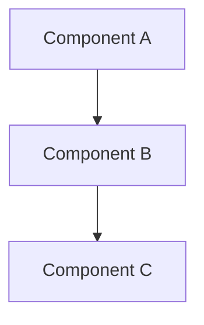

# Architecture Overview

## System Description
[High-level description of the system, its purpose, and key capabilities]

## Component Diagram

## Key Design Decisions
- [Decision 1 with link to ADR]
- [Decision 2 with link to ADR]

## Technology Stack
| Layer | Technology | Version | Rationale |
|-------|------------|---------|-----------|
| Runtime | Node.js | 20.x | LTS, performance |
| Language | TypeScript | 5.x | Type safety |
| Framework | [Framework] | [Version] | [Reason] |
| Database | [Database] | [Version] | [Reason] |
| Testing | Vitest | Latest | Fast, TypeScript native |

## Non-Functional Requirements
- **Performance**: [Latency/throughput targets]
- **Scalability**: [Horizontal/vertical scaling approach]
- **Availability**: [Uptime targets, disaster recovery]
- **Security**: [Compliance requirements]