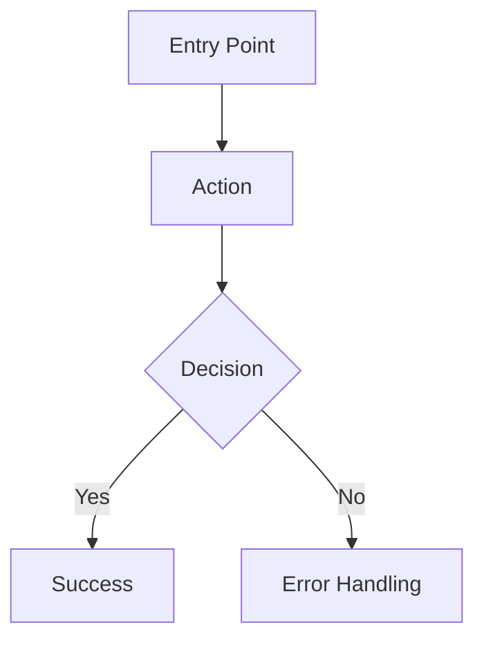

# Product Requirements Document (PRD) Template

## Document Control
| Field | Value |
|-------|-------|
| **Product** | [Product Name] |
| **Version** | [Version] |
| **Status** | Draft | In Review | Approved | Archived |
| **Author** | [Author Name/Role] |
| **Reviewers** | [Reviewer Names/Roles] |
| **Created** | YYYY-MM-DD |
| **Last Updated** | YYYY-MM-DD |
| **Approved By** | [Approver Name/Role] |
| **Approval Date** | YYYY-MM-DD |

---

## 1. Executive Summary
**One-paragraph summary of the product/feature, its purpose, and key value proposition.**

---

## 2. Problem Statement
**What problem does this solve? Who experiences this problem? Why is it important now?**

- **User Pain Points**: [List specific pains]
- **Business Impact**: [Revenue, retention, efficiency, compliance]
- **Current Workarounds**: [How users solve this today]

---

## 3. Goals & Success Metrics

### 3.1 Product Goals
| Goal | Description | Priority |
|------|-------------|----------|
| G1 | [Goal description] | High/Medium/Low |
| G2 | [Goal description] | High/Medium/Low |

### 3.2 Success Metrics (KPIs)
| Metric | Target | Measurement Method |
|--------|--------|-------------------|
| [Metric name] | [Target value] | [How measured] |
| [Metric name] | [Target value] | [How measured] |

### 3.3 Non-Goals
- [Explicitly out of scope]

---

## 4. User Personas & Stories

### 4.1 Primary Personas
| Persona | Description | Key Needs |
|---------|-------------|-----------|
| [Name] | [Role/description] | [Needs] |

### 4.2 User Stories
| ID | Story | Acceptance Criteria |
|----|-------|---------------------|
| US-1 | As a [persona], I want to [action] so that [benefit] | 1. [Criterion] 2. [Criterion] |
| US-2 | As a [persona], I want to [action] so that [benefit] | 1. [Criterion] 2. [Criterion] |

---

## 5. Functional Requirements

### 5.1 Feature Requirements
| ID | Feature | Description | Priority | Dependencies |
|----|---------|-------------|----------|--------------|
| FR-1 | [Feature name] | [Detailed description] | High/Med/Low | [Dep IDs] |
| FR-2 | [Feature name] | [Detailed description] | High/Med/Low | [Dep IDs] |

### 5.2 User Flows

### 5.3 Edge Cases
- [Edge case 1]: [Handling]
- [Edge case 2]: [Handling]

---

## 6. Non-Functional Requirements

| Category | Requirement | Target |
|----------|-------------|--------|
| **Performance** | [e.g., API response < 200ms] | [Target] |
| **Scalability** | [e.g., 10k concurrent users] | [Target] |
| **Availability** | [e.g., 99.9% uptime] | [Target] |
| **Security** | [e.g., SOC2, encryption] | [Standard] |
| **Compliance** | [e.g., GDPR, HIPAA] | [Standard] |
| **Accessibility** | [e.g., WCAG 2.1 AA] | [Standard] |
| **Reliability** | [e.g., error rate < 0.1%] | [Target] |

---

## 7. Technical Requirements

### 7.1 Architecture
- [Reference to ADRs in `context/decisions/`]
- [Integration points]
- [Data models]

### 7.2 API Contracts
- [Reference to `context/specs/api-contracts.md` or OpenAPI spec]

### 7.3 Data Requirements
- [Data models, retention, migration]

### 7.4 Infrastructure
- [Hosting, CI/CD, monitoring]

---

## 8. Design & UX

### 8.1 Wireframes/Mockups
- [Link to Figma/design files]

### 8.2 Design System
- [Components, tokens, patterns]

### 8.3 Accessibility Notes
- [Specific a11y considerations]

---

## 9. Release Plan

### 9.1 Phases
| Phase | Scope | Target Date | Criteria |
|-------|-------|-------------|----------|
| MVP | [Core features] | YYYY-MM-DD | [Done criteria] |
| Phase 2 | [Additional features] | YYYY-MM-DD | [Done criteria] |

### 9.2 Rollout Strategy
- [Canary, blue/green, feature flags, etc.]

### 9.3 Rollback Plan
- [How to revert if issues]

---

## 10. Risks & Mitigations

| Risk | Likelihood | Impact | Mitigation |
|------|------------|--------|------------|
| [Risk description] | High/Med/Low | High/Med/Low | [Mitigation strategy] |

---

## 11. Dependencies

### 11.1 Internal Dependencies
- [Team/system dependencies]

### 11.2 External Dependencies
- [Third-party APIs, vendors, approvals]

---

## 12. Open Questions
- [Question 1]
- [Question 2]

---

## 13. Appendix
- [Glossary, references, research links]