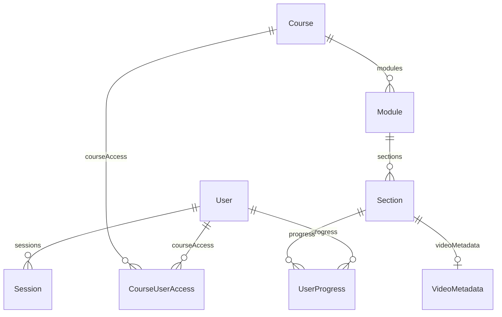

# Esquema de base de datos

Fuente ejecutable: [`backend/prisma/schema.prisma`](../backend/prisma/schema.prisma). Este documento acompaña el esquema, no lo sustituye.

## Relaciones

| Modelo | Propósito | Invariantes relevantes |
|---|---|---|
| `User` | Cuenta y rol global | `email` y `username` únicos; borrado lógico |
| `Session` | Sesión de magic-link | `token` único; pertenece a un usuario |
| `Course` | Raíz del currículo | borrado lógico; contiene módulos |
| `Module` | Agrupación de secciones | pertenece a un curso; borrado lógico |
| `Section` | Lección | pertenece a un módulo; contenido Markdown y vídeo opcionales; borrado lógico |
| `VideoMetadata` | Metadatos de un vídeo | un registro por sección (`sectionId` único); borrado lógico |
| `UserProgress` | Avance por lección | único por `[userId, sectionId]`; borrado lógico |
| `CourseUserAccess` | Permiso de un usuario en un curso | único por `[userId, courseId]`; niveles `READ`, `WRITE`, `MAINTAIN` |

Los enums son `Role` (`ADMIN`, `INSTRUCTOR`, `STUDENT`), `AccessLevel`, `Difficulty`, `PrimaryStyle` y `VideoType`. `PrimaryStyle` incluye `MAMBO_ON2`, `CASINO`, `SENSUAL_BACHATA` y `MODERN_BACHATA`.

## Estado de migraciones y seed

El repositorio debe evolucionar el esquema mediante migraciones Prisma versionadas. El CI actual todavía emplea `prisma db push`, y el seed actual duplica cursos si se ejecuta más de una vez; ambos puntos están pendientes en el [roadmap de ingeniería](roadmaps/engineering.md). No se debe tratar este documento como prueba de que el bootstrap automático ya existe.
